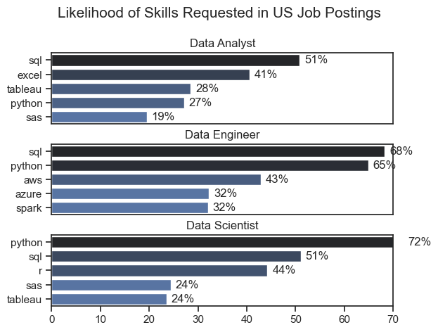
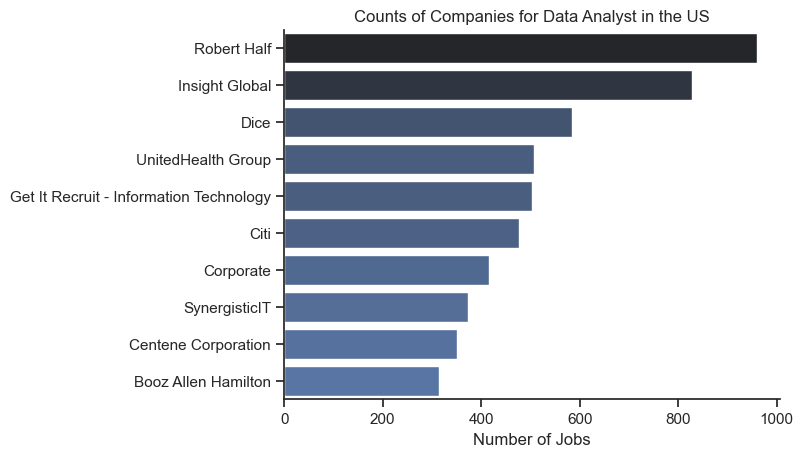
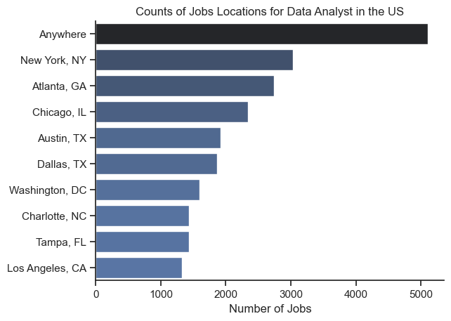
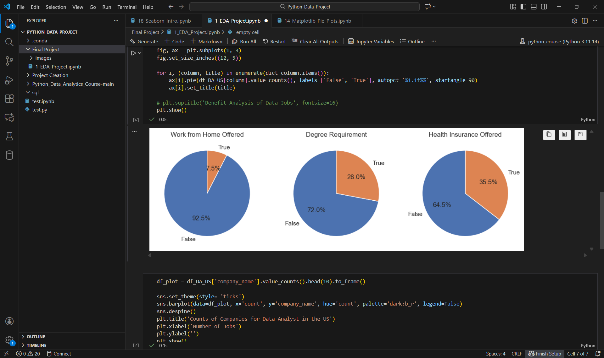

# The Analysis

## 1. What are the most demanded skills for the top 3 most popular data roles?
This analysis examines the most in-demand skills for the three most popular data roles in the job market. Roles were first identified based on posting frequency, after which the top five skills associated with each role were extracted and analyzed.

The results highlight how skill demand varies by role, providing clear insight into which technical skills are most valuable depending on the specific data position being targeted. This allows for more informed career planning and skill development aligned with current market demand.

View my notebook here: [2_Skills_Count.ipynb](./Final%20Project/2_Skills_Count.ipynb)


### Visualize Data

```python
fig, ax = plt.subplots(len(job_titles), 1)

sns.set_theme(style='ticks')

for i, job_title in enumerate(job_titles):
    df_plot = df_skills_perc[df_skills_perc['job_title_short'] == job_title].head(5)
    sns.barplot(data=df_plot, x='skill_percent', y='job_skills', ax=ax[i], hue='skill_count', palette='dark:b_r')
    ax[i].set_title(job_title)
    ax[i].set_ylabel('')
    ax[i].set_xlabel('')
    ax[i].legend().remove()
    ax[i].set_xlim(0, 70)

    for n, v in enumerate(df_plot['skill_percent']):
        ax[i].text(v + 1, n, f'{v:.0f}%', va='center')

    if i != len(job_titles)-1:
        ax[i].set_xticks([])

fig.suptitle('Likelihood of Skills Requested in US Job Postings', fontsize=15)
fig.tight_layout(h_pad=0.5)
plt.show()
```

### Cleaning the Data
Before analysis, the dataset was cleaned and standardized to ensure reliable salary insights. Missing values were handled appropriately, salary fields were normalized, and job titles were consolidated for consistency. I then used a pivot table to aggregate median annual salaries by job country and job title, reducing the impact of outliers and enabling meaningful cross-country comparisons across data roles.


### Results


Below is a visualization showing the most in-demand technical skills for Data Analysts based on U.S. job postings.




## Additional Market Insights: U.S. Data Analyst Roles
To complement the skills analysis, the following visualizations explore job benefits, hiring concentration, and geographic demand for Data Analyst roles across the United States.

### Work Arrangement, Degree & Benefits Overview
These charts summarize key job requirements and benefits across U.S. Data Analyst postings:

- Remote Work: The majority of roles are still listed as on-site or hybrid, with fully remote positions representing a smaller share of postings.
- Degree Requirements: While many positions still require a degree, a notable portion of roles do not explicitly mandate formal education, highlighting increasing skills-based hiring.
- Health Insurance: Most roles offer health insurance, though a meaningful minority do not list this benefit explicitly.

Insight: Employers increasingly prioritize skills and experience, but benefits and flexibility vary significantly across postings.


### Top Hiring Companies
This visualization highlights companies with the highest number of Data Analyst job postings in the U.S.
- Staffing and consulting firms such as Robert Half and Insight Global dominate postings.
- Large enterprises and technology-focused organizations also appear frequently, indicating consistent demand across industries.

Insight: A significant share of opportunities comes from recruiting agencies and consulting firms, which can be strategic entry points for analysts seeking market exposure.

```python
dict_column = {
    'job_work_from_home': 'Work from Home Offered',
    'job_no_degree_mention': 'Degree Requirement',
    'job_health_insurance': 'Health Insurance Offered'
}

fig, ax = plt.subplots(1, 3)
fig.set_size_inches((12, 5))

for i, (column, title) in enumerate(dict_column.items()):
    ax[i].pie(df_DA_US[column].value_counts(), labels=['False', 'True'], autopct='%1.1f%%', startangle=90)
    ax[i].set_title(title)

# plt.suptitle('Benefit Analysis of Data Jobs', fontsize=16)
plt.show()
```




### Geographic Distribution of Roles
This chart shows where Data Analyst jobs are most concentrated:

- “Anywhere” (Remote) roles represent the largest category, reflecting continued demand for location-agnostic talent.
- Major metropolitan areas like New York, Atlanta, Chicago, Austin, and Dallas remain strong hiring hubs.

Insight: While remote roles are growing, urban tech and business centers still offer the highest volume of opportunities.



### Skills Trend for Data Jobs
Analysis of U.S. job postings shows clear and consistent skill demand patterns across data roles.
- SQL and Python dominate skill requirements, with SQL leading for Data Analyst roles and Python appearing most frequently for Data Scientists and Data Engineers.
- Excel and Tableau remain highly relevant for Data Analysts, reinforcing the importance of data cleaning, reporting, and visualization alongside programming skills.
- Specialization increases with seniority and role type: Data Engineers show higher demand for cloud and big-data tools (e.g., AWS, Azure, Spark), while Data Analysts focus more on querying, analysis, and business-facing tools.
- Skill overlap across roles suggests strong transferability, especially for analysts expanding into engineering or data science paths.


### Salary Analysis of Data Jobs
Salary trends highlight meaningful differences by role and geography.

- Median salaries increase with role specialization, with Data Engineers and Data Scientists consistently earning more than Data Analysts across countries.
- Senior-level roles show significant salary premiums, particularly for Senior Data Engineers and Senior Data Scientists.
- Geographic analysis indicates that countries with higher volumes of job postings also tend to offer higher median salaries, suggesting stronger and more competitive data markets.

Salary distributions emphasize the value of combining technical depth with role specialization when targeting higher compensation.



### Optimal Skills for Data Analysts
Based on demand frequency, role requirements, and compensation trends, the most effective skill stack for Data Analysts includes:


- Core Skills: SQL, Excel, Python
- Visualization & Reporting: Tableau (or similar BI tools)
- Foundational Analytics: Data cleaning, aggregation, and exploratory analysis
- Career Leverage Skills: Python proficiency enables smoother transitions into Data Science or Data Engineering roles


The data suggests that Data Analysts who build strong SQL foundations and progressively add Python and visualization skills are best positioned for career growth, role flexibility, and salary advancement.


## Summary Takeaway

- Python remains the most versatile and in-demand skill across data roles, with especially high demand for Data Scientists and Data Engineers, highlighting its importance for advanced analytics and modeling.
- SQL is a core requirement for Data Analysts, appearing in a majority of job postings, reinforcing its role as a foundational skill for querying, transforming, and validating data.
- Skill expectations vary by role: Data Engineers tend to require more specialized technologies (e.g., cloud platforms and big data tools), while Data Analysts and Data Scientists are expected to be proficient in general data analysis and visualization tools such as Excel and Tableau.
- Job postings indicate that practical experience often outweighs formal credentials, with many roles not explicitly requiring a degree.
- Consulting and staffing firms dominate hiring activity, suggesting strong demand for analysts who can quickly adapt across industries and projects.
- Remote work is available but not universal, with opportunities still concentrated in major U.S. job hubs such as New York, Atlanta, and Chicago.


Together, these insights show that the U.S. Data Analyst market:
- Values practical skills over strict credentials
- Is heavily driven by consulting and staffing firms
- Continues to balance remote flexibility with geographic hubs

These findings help inform job-search strategy, skill prioritization, and location targeting for aspiring and transitioning Data Analysts.


